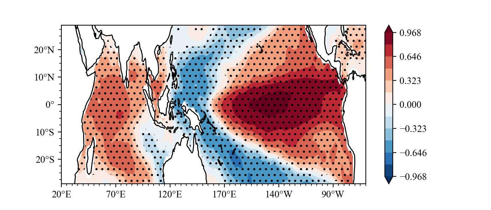

# SACPY -- A Python Package for Statistical Analysis of Climate

**Sacpy**, inspired from xMCA, a repaid Statistical Analysis tool for Climate or Meteorology data.

Author : Zilu Meng

e-mail : mzll1202@163.com

## Why choose Sacpy?

### Quick!

For example, Sacpy is more than 40 times faster than the traditional regression analysis with Python (see example 1).

### Turn to climate data customization!

Compatible with commonly used meteorological calculation libraries such as numpy and xarray.


## Install

        pip install sacpy


## Example

Calculate the correlation between SST and nino3.4 index

```Python
import numpy as np
import scapy as scp
# load sst
sst = scp.load_sst()['sst']
# get ssta (method=1, Remove linear trend;method=0, Minus multi-year average)
ssta = scp.get_anom(sst,method=1)
# calculate Nino3.4
Nino34 = ssta.loc[:,-5:5,190:240].mean(axis=(1,2))
# regression
linreg = scp.LinReg(np.array(Nino34),np.array(ssta))
# plot
plt.contourf(linreg.corr)
# Significance test
plt.contourf(linreg.p_value,levels=[0, 0.05, 1],zorder=1,
            hatches=['..', None],colors="None",)
# save
plt.savefig("./nino34.png")

```
Result(For a detailed drawing process, see **example**):



### Speed 

As example, if we use conventional for-loop to finish it, it will take 40 times more time (see **example**).